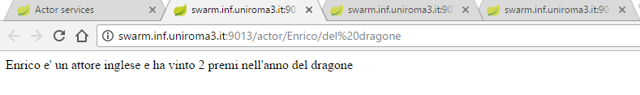

# Asw secondo progetto 

## Dominio applicativo

Il servizio actor fornisce due operazioni:
 1. `/actor/<attore>/<anno>` restituisce informazioni (casuali) sull'`<attore>` (la nazionalità) e sul numero (casuale) di premi vinti in quell'anno.
 2. `/actor/<attore>` restituisce invece informazioni (casuali) sull'`<attore>` (nazionalità) e sul numero (casuale) dei premi vinti nella  sua carriera.

Ad esempio, la richiesta /actor/Benigni/1997, potrebbe restituire "Benigni è un attore italiano ed ha vinto 5 premi nel 1997".    
La richiesta /actor/Benigni potrebbe restituire "Benigni è un attore italiano ed ha vinto 50 premi nella sua carriera".    
Il servizio actor viene implementato con due servizi secondari nationality e award nel seguente modo: la richiesta `nationality/<attore>` restituisce la nazionalità (casuale) dell'attore. (ad esempio la richiesta /S1/Benigni potrebbe restituire "italiano").    
La richiesta `award/<attore>/<anno>` restituisce il numero (casuale) dei premi vinti dall'attore nell'anno specificato (ad esempio /award/Benigni/1997 potrebbe restituire 5).    
La richiesta `award/<attore>` restituisce il numero (casuale) dei premi vinti dall'attore nella sua carriera (ad esempio /award/Benigni potrebbe restituire 50).    
Il servizio actor risponde al suo client usufruendo dei servizi nationality e award e integrando le loro risposte.

## Operazioni eseguite per il rilascio:

Dalla cartella principale:
1. aperta una shell
2. eseguito il comando 'sh build-all-projects.sh' (gradle build delle applicazioni) 
3. eseguito il comando 'sh build-all-images.sh' (docker build delle immagini)
4. eseguito il comando 'sh push-all-images.sh' (caricamento delle immagini sullo swarm)
5. eseguito il comando 'sh start-actor-stack.sh' (avvio delle istanze delle immagini docker sullo swarm)

## Fruibilità del servizio:

Il servizio offerto può essere acceduto se si dispone dei corretti certificati e di una connessione ad una rete apposita attraverso l'indirizzo `http://swarm.inf.uniroma3.it:9013`
(9013 è la porta assegnata per questo servizio).

Inoltrando le giuste richieste o utilizzando i link di esempio è possibile accedere ad una schermata di questo tipo:

</img>  

